# 🛡️ Wazuh MCP Threat Hunting Project


## 📖 專案簡介 (Overview)
本專案實作了一個基於 **Model Context Protocol (MCP)** 的伺服器，旨在整合 **Wazuh SIEM** 進行自動化的威脅獵捕 (Threat Hunting)。透過這個 MCP Server，AI Agent (如 Claude 或其他 LLM) 可以直接與 Wazuh API 互動，查詢日誌、分析告警並執行即時的安全分析。

**核心目標：**
1. 簡化資安分析師查詢 Wazuh 複雜日誌的流程。
2. 利用 LLM 的推理能力來關聯分散的資安事件。
3. 提供一個標準化的介面來存取資安數據。

## ✨ 功能亮點 (Key Features)
- [x] **Wazuh API 整合**：自動驗證並連接至 Wazuh Manager。
- [x] **日誌查詢工具**：透過 MCP Tool 讓 AI 檢索特定 Agent 的安全事件。
- [x] **威脅分析**：自動過濾高風險 (Level 10+) 的告警。
- [ ] **(未來規劃)** 自動化封鎖 IP 功能。

## 🛠️ 技術架構 (Architecture)

```mermaid
graph LR
    %% 定義樣式
    classDef ai fill:#E1F5FE,stroke:#01579B,stroke-width:2px;
    classDef mcp fill:#FFF3E0,stroke:#FF6F00,stroke-width:2px;
    classDef wazuh fill:#E8F5E9,stroke:#2E7D32,stroke-width:2px;

    subgraph User_Layer [1. Interaction Layer]
        User(("User/Analyst"))
        Claude["🤖 AI Agent<br/>(Claude Desktop)"]:::ai
    end

    subgraph Integration_Layer [2. Integration Layer]
        MCP["⚙️ MCP Server<br/>(Python/FastMCP)"]:::mcp
        Tools["🛠️ Tools Logic<br/>- Alert Filtering<br/>- Agent Query"]:::mcp
    end

    subgraph Infrastructure_Layer [3. Data Layer]
        API["🔌 Wazuh API"]:::wazuh
        Manager["🛡️ Wazuh Manager"]:::wazuh
        Logs[("🗄️ Security Logs")]:::wazuh
    end

    %% 連線
    User -->|"Natural Language Query"| Claude
    Claude <-->|"MCP Protocol (JSON-RPC)"| MCP
    MCP <-->|"Internal Function Call"| Tools
    Tools <-->|"HTTPS / REST API"| API
    API <-->|"Query Data"| Manager
    Manager <-->|"Read"| Logs
```


- **語言**: Python
- **協定**: Model Context Protocol (MCP)
- **資料來源**: Wazuh SIEM / Indexer
- **依賴套件**: `mcp`, `requests`, `python-dotenv`

## 🚀 安裝與執行 (Installation & Usage)

### 前置需求 (Prerequisites)
- Python 3.10 或更高版本
- 一個運作中的 Wazuh Manager (需開啟 API 存取權限)
- [Claude Desktop](https://claude.ai/download) (若使用 Claude 作為客戶端)

### 1. 下載專案
```bash
git clone [https://github.com/kirisame1188/Wazuh-MCP-Threat-Hunting-Project.git](https://github.com/kirisame1188/Wazuh-MCP-Threat-Hunting-Project.git)
cd Wazuh-MCP-Threat-Hunting-Project
```
## Demo
結合claude+mcp分析wazuh
1.列出所有 Agent 狀態，用於確認環境監控範圍
2.獲取最近的資安警報,用於威脅獵捕分析 (Threat Hunting)
3.生成報告
